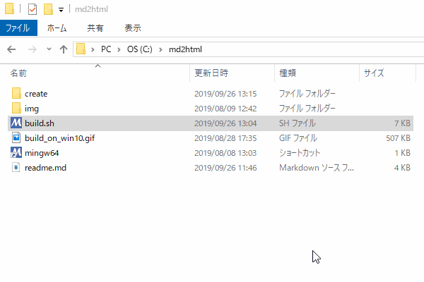

# md2htmlについて

## 概要

markdownのファイルからhtmlを生成します。  

* markdown.cssファイルがあればminifyしてhtmlに埋め込みます。

* 序に画像ファイル(拡張子がjpg,png,gif)をbase64にエンコードして、  
テキストとしてhtmlに埋め込みます。

これらの処理により、markdownと画像のファイル群から  
html単体で画像やCSSを含んだ可搬性のある文書が生成できます。

例えば

* [readme.md](https://static.xcd0.com/2019/10/30/readme.md)
	* 文字コードをutf-8にしないと文字化けします。
	* 今見ているこのreadme.mdと同じファイルです。
* [markdown.css](https://static.xcd0.com/2019/10/30/markdown.css)
	* 適応したいCSSファイルを与えることができます。
* [build_on_win10.gif](https://static.xcd0.com/2019/10/30/build_on_win10.gif)
	* jpg,png,gifなどを埋め込むことができます。

これらのファイルから

* [readme.html](https://static.xcd0.com/2019/10/30/readme.html)

を生成できます。  
この生成したhtmlファイルは上記の3つのファイルの情報をすべて含んだhtmlファイルです。  
なのでこれ単体で完結するため、そのまま他人に渡すことができます。

メインの処理はGolangで書いており、基本的にどのOSでも動作します。

* MathJax も使えます。
	* ただしhtmlをオフラインで使用する場合同じディレクトリにMathJax-3.0.0を置いてください。

## 使用方法

1. マークダウンの書式のテキスト文書を拡張子`.md`で保存する。  
マークダウンファイルと同じディレクトリに`markdown.css`ファイルを置くと適応される。  
`markdown.css`がない場合、デフォルトのcssが適応される。  
画像などはマークダウン内のパス記述に従って配置する。  
つまり同じディレクトリにある必要はない。

1. 実行ファイル `md2html` にマークダウンのファイルをドラッグアンドドロップして投げる。  
これでhtmlファイルが生成される。
	* もちろんコマンドラインで第一引数に指定してもよい。

## 使用条件

* 過去存在したすべての使用条件を取り除いた。  
マウスがあってマークダウンファイルを実行ファイルにドラッグアンドドロップできれば良い。

## 独自記法
以下はスライドで使用する独自の書式についての説明。

### 現状最低限の機能の実装中。
* 現状チェックは厳密に行われ、ダブルクオートや空白まで含めて、一字一句間違えると動作しない。
* 基本的にMarpの書式に似せる。しかし、完全互換ではない。
* 書式自由度が低いのは処理速度向上のためもあるが、単純に実装の手間の問題。暇になったらやる。
	* プルリク大歓迎\_(┐「ε:)\_

### 書式について
* マークダウンファイル内の改行をそのまま出力するようにしている。
	* 本来の書式では行末に半角空白2文字が必要。
	* 実装としては単純にすべての改行の直前に空白2文字を付与してからhtmlに変換している。
* `<!-- $`で始まるもの適当にプリアンブルと呼んでいる。
	* ただしどこでも設定できるので全然preじゃない。名前変えた方がいい。
* 現状プリアンブルは必ず行頭から`<!-- $`で始まらなければならない。
	* `:`の右はダブルクオートで囲み値を指定する。
	* 値の後ろは閉じるダブルクォーテーションの後、半角空白1文字を開けて`-->`で改行する。
		* 値の前の部分は`^<!-- \$[^$:"\^ ]{2,}:"`にマッチする。
		* 値の後ろの部分は`" -->$`にマッチする。
		* 値は数値とあれば整数と小数を指定する。負の数、指数表記は不可。
		* 値は文字列とあればstring型として扱われる。
		この場合そのままhtmlに出力される。そのためhtmlタグなどが使える。
		* 値は真偽値とあれば`"true"`または`"false"`を指定する。
	* ページをまたいで引き継がれる。そのページのみの指定は実装していない。
		* つまり直前のページと設定を変更したいときは上書きすればよい。
		* ただしsize,width,heightに関しては表紙ページでのみ指定でき、設定したら変更できない。

|記号|意味|
|---|---|
|===|ページ区切り。印刷時は改ページされる。|
|`<!-- $width:"数値" -->`|ページの幅を指定する。小数可。単位はmmのみ。 sizeがあれば無効。|
|`<!-- $height:"数値" -->`|ページの高さを指定する。小数可。単位はmmのみ。 sizeがあれば無効。|
|`<!-- $size:"比率" -->`|ページ比率を指定する。"4:3"と"16:9"のみ指定できる。 横幅はA4サイズ。内部的には保持していない。|
|`<!-- $page_number:"真偽値" -->`|ページ番号を表記する。 初期状態では表紙はページ数を表示せず、 次のページを1ページ目とする。|
|`<!-- $set_page_number:"数値" -->`|そのページのページ数を指定する。 表示には`$page_number`に`"true"`が 指定されている必要がある。|
|`<!-- $footer:"文字列" -->`|そのページの下部に表記したい文字列を指定。 基本的にhtmlタグ可能。|
|`<!-- $title:"真偽値" -->`|そのページ以降でタイトルとサブタイトルを表示するかどうか設定する。|
|`<!-- $h2:"文字列" -->`|h2を書き換える。そのページのタイトルになる。|
|`<!-- $h3:"文字列" -->`|h3を書き換える。そのページのサブタイトルになる。|

<!--
|`<!-- $h1:"文字列" - ->`|h1を書き換える。ただしh1は表紙のタイトルになるので書き換えても意味がない。|
|`<!-- $:"" - ->`||
|||
|||
-->

## FAQ

* `_`が誤変換される。
	* 誤変換ではない。
		* これはマークダウンの斜体記法(文字列の前後を`_`で囲む)が原因。
		* マークダウン上でアンダースコアの前にバックスラッシュをつければ回避できます。  
		例）マークダウン内記述`\_(┐「ε:)\_` → 出力`_(┐「ε:)_`

* htmlが文字化けした
	* ~~mdファイルの文字コードが`Shift-jis`だと文字化けする。~~  
	`Shift-jis`は内部で勝手に文字コードを変換するようにした。
	* 改行コードも内部的には勝手に`LF`に変換している。
	* ダメなら`UTF-8 LF`で保存する。

* 特殊なOS、CPUで使用するしたい  (32bit版やアーキテクチャがx86系じゃないやつ)
	* 環境に合わせてビルドしてください。`Makefile`あるので`make`で一発です。
	* Golangでビルドできる環境なら動きます。
		* [https://golang.org/doc/install#requirements](https://golang.org/doc/install#requirements)を参照。
		* `If your OS or architecture is not on the list, you may be able to install from source or use gccgo instead.`だそうです
		* 2019/10/01時点の対応表

|Operating system	|	Architectures	|	Notes |
|---|---|---|
|FreeBSD 10.3 or later	amd64, 386	|	Debian GNU/kFreeBSD not supported |
|Linux 2.6.23 or later with glibc	|	amd64, 386, arm, arm64, s390x, ppc64le	|	CentOS/RHEL 5.x not supported.  Install from source for other libc. |
|macOS 10.10 or later	|	amd64	|	use the clang or gcc† that comes with Xcode‡ for cgo support |
|Windows 7, Server 2008R2 or later	|	amd64, 386	|	use MinGW (386) or MinGW-W64 (amd64) gcc†. No need for cygwin or msys. |

## 変更履歴

|改定日		|版		|内容					|
|:---:|:---:|:---:|
|2019/08/28	|1		|新規作成。				|
|2019/09/26	|2		|Makefileによるbase64.goのクロスコンパイル環境を作成。 ログを出力するように変更。 readme.mdにいろいろ追記した。|
|2019/10/01	|3		|hugoのバイナリを同梱するのをやめた OSに合わせて自動でDLするようにした。|
|2019/10/30	|4		|shellscriptをやめた。 全部Golangで書きなおした。 これによりすべての使用条件を撤廃、実行時間が100倍はやくなった。|
|2019/11/12 |       |Hugoの使用を廃止。作業中。|

