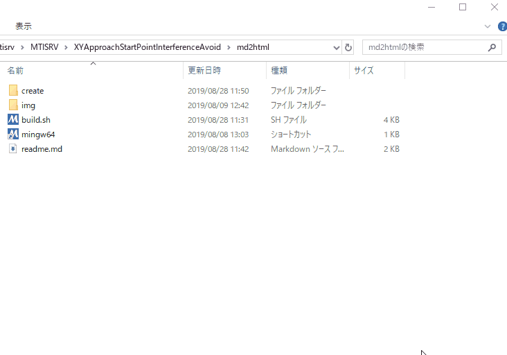

<!-- $title:"true" -->

# md2htmlについて

<!---->

## 概要

markdownのファイルからhtmlを生成します。  

* markdown.cssファイルがあればminifyしてhtmlに埋め込みます。

* 序に画像ファイル(拡張子がjpg,png,gif)をbase64にエンコードして、  
テキストとしてhtmlに埋め込みます。

これらの処理により、markdownと画像のファイル群から  
html単体で画像やCSSを含んだ可搬性のある文書が生成できます。

<!---->

例えば

* [readme.md](https://static.xcd0.com/2019/11/22/readme.md)
* [build.gif](https://static.xcd0.com/2019/11/22/build.gif)

これらのファイルから

* [readme.html](https://static.xcd0.com/2019/11/22/readme.html)

を生成できます。  

<!---->

この生成したhtmlファイルは上記の3つのファイルの情報をすべて含んだhtmlファイルです。  
なのでこれ単体で完結するため、そのまま他人に渡すことができます。

メインの処理はGolangで書いており、基本的にどのOSでも動作します。

* MathJax も使えます。
	* ただしhtmlをオフラインで使用する場合同じディレクトリにMathJax-3.0.0を置いてください。

<!---->

## 使用方法

### 1. マークダウンの書式の文書を拡張子`.md`で保存する。  
マークダウンファイルと同じディレクトリに`markdown.css`ファイルを置くと適応される。  
`markdown.css`がない場合、デフォルトのcssが適応される。  
画像などはマークダウン内のパス記述に従って配置する。  
つまり同じディレクトリにある必要はない。

<!---->

### 2. 実行ファイルにマークダウンのファイルを投げる。  
D&Dでexeに投げると、htmlファイルが生成される。

* もちろんコマンドラインで第一引数に指定してもよい。

<!---->

## 機能
1. markdowsのファイルと参照される画像ファイルから1つのHTMLファイルを生成する。(印刷用HTMLと呼ぶ)
2. 序にブラウザで開くとスライドのようにスクロールできるHTMLファイルを生成する。(スライド用HTMLと呼ぶ)

## 実装予定
* 画像ファイルの表示サイズ制御、表示位置制御。
* フォント色の簡単な制御方法の実装。 
* 印刷用HTMLからPDFを生成。
* (印刷用HTMLのみ) Wordのようなコメント機能の代替となるものを実装。
* (HTMLのみ) Youtubeの埋め込み。
	* オフライン時にはどうするか仕様検討が必要。

<!---->

## 使用条件

* 過去存在したすべての使用条件を取り除いた。  
マウスがあってマークダウンファイルを実行ファイルにドラッグアンドドロップできれば良い。

<!---->

## 独自記法
以下はスライドで使用する独自の書式についての説明。

### 現状最低限の機能の実装中。

* 現状チェックは厳密に行われ、ダブルクオートや空白まで含めて、一字一句間違えると動作しない。
* 基本的にMarpの書式に似せる。しかし、完全互換ではない。
* 書式自由度が低いのは処理速度向上のためもあるが、単純に実装の手間の問題。暇になったらやる。
	* プルリク大歓迎\_(┐「ε:)\_

<!---->

* マークダウンファイル内の改行をそのまま出力するようにしている。
	* 本来の書式では行末に半角空白2文字が必要。
	* 実装としては単純にすべての改行の直前に空白2文字を付与してからhtmlに変換している。

* `<!-- $`で始まるもの適当にプリアンブルと呼んでいる。
	* ただしどこでも設定できるので全然preじゃない。名前変えた方がいい。

<!---->

* 現状プリアンブルは必ず行頭から`<!-- $`で始まらなければならない。
* `:`の右はダブルクオートで囲み値を指定する。
* 値の後ろは閉じるダブルクォーテーションの後、半角空白1文字を開けて`-->`で改行する。
* 値の前の部分は`^<!-- \$[^$:"\^ ]{2,}:"`にマッチする。値の後ろの部分は`" -->$`にマッチする。

<!---->

* 値は数値とあれば整数と小数を指定する。負の数、指数表記は不可。
* 値は文字列とあればstring型として扱われる。
* 値は真偽値とあれば`"true"`または`"false"`を指定する。
* ページをまたいで引き継がれる。そのページのみの指定は実装していない。
	* つまり直前のページと設定を変更したいときは上書きすればよい。
	* ただしsize,width,heightに関しては表紙ページでのみ指定できる。

<!---->

### ページサイズ

|実装|記号|意味|
|---|---|---|
|〇|`<!-- $width:"数値" -->`|ページの幅を指定する。小数可。単位はmmのみ。 sizeがあれば無効。|
|〇|`<!-- $height:"数値" -->`|ページの高さを指定する。小数可。単位はmmのみ。 sizeがあれば無効。|
|〇|`<!-- $size:"比率" -->`|ページ比率を指定する。"4:3"と"16:9"のみ指定できる。 横幅はA4サイズ。内部的には保持していない。|

<!---->

### ページ数の表示

左下にページ数表記をする。
実際のページ数と、ページ内に表記される数値を変えることもできる。
ページ数を表記しないこともできる。

初期状態では表紙を0とし、表紙にページ数を表示しない。
表紙にもページ数を表記したい場合、`<!-- $page_number:"true" -->`を表紙に表記する。

|実装|記号|意味|
|---|---|---|
|〇|`<!-- $page_number:"真偽値" -->`|ページ番号を表記する。|
|〇|`<!-- $set_page_number:"数値" -->`|そのページの表示されるページ数を指定する。|

<!---->

### タイトル表示

markdownファイル内の`h1`要素は1ファイルに1つ以下とする。
これを表紙のタイトルとする。
各ページの見出しを`h2`で表現する。
小見出しを`h3`で表現する。
`h4`以下は特別な解釈をしない。

|実装|記号|意味|
|---|---|---|
|〇|`<!-- $h2:"文字列" -->`|h2を書き換える。タイトルになる。|
|〇|`<!-- $h3:"文字列" -->`|h3を書き換える。サブタイトルになる。|
|〇|`<!-- $title:"真偽値" -->`|h2,h3が指定されていないとき、 引き継いで表示するかどうか設定する。|
|〇|`<!-- $footer:"文字列" -->`|そのページの下部に表記したい文字列を指定。

<!---->

### ページサイズ

|実装|記号|意味|
|---|---|---|
|〇|`<!---->`|ページ区切り。印刷時は改ページされる。|
|×|`<!-- $h2_page_break:"真偽値" -->`|`h2`(マークダウンで言う`##`)で改行するか。|

<!--
|`<!-- $h1:"文字列" - ->`|h1を書き換える。ただしh1は表紙のタイトルになるので書き換えても意味がない。|
|`<!-- $:"" - ->`||
|||
|||
-->

<!---->

## FAQ

### `_`が誤変換される。
* 誤変換ではないかも。
	* これはマークダウンの _斜体記法_ (文字列の前後を`_`で囲む)が原因。
	* マークダウン上でアンダースコアの前にバックスラッシュをつければ回避できます。  
	例）マークダウン内記述`\_(┐「ε:)\_` → 出力`_(┐「ε:)_`

<!---->

### htmlが文字化けした
* ~~mdファイルの文字コードが`Shift-jis`だと文字化けする。~~
	* `Shift-jis`は内部で勝手に文字コードを変換するようにした。
* 改行コードも内部的には勝手に`LF`に変換している。
* ダメなら`UTF-8 LF`で保存する。

<!---->

## 変更履歴

|改定日		|版		|内容					|
|:---:|:---:|:---:|
|2019/08/28	|1		| 新規作成。			|
|2019/09/26	|2		| base64エンコード実装。|
|2019/10/01	|3		| hugoのバイナリを同梱するのをやめた OSに合わせて自動でDLするようにした。|
|2019/10/30	|4		| shellscriptをやめ全てGolangで書きなおした。 これにより全ての使用条件を撤廃、 100倍早くなった。|
|2019/11/21 |5      | Hugoの使用を廃止。 スライド用htmlを生成するようになった。 |

